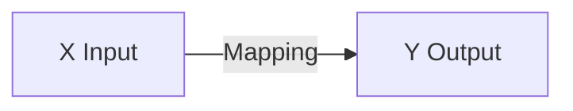

## <u>What is Machine Learning?</u>

Machine learning is a way for computers to learn from data without being specifically programmed. It uses algorithms which can examine through data, learn from it, and then apply that knowledge to make decisions and predictions.

> *Andrew Ng*-
>
> *It's a science of getting computers to learn without being explicitly programmed.*

> In layman's terms, machine learning is the process of having a computer learn from data without having to explicitly program it. It uses `algorithms` to figure out `patterns` in `data` and then use those patterns to make `decisions` or `predictions`.
{: .prompt-info }

---

## <u>Machine Learning Algorithm Types</u>

1. Supervised Learning (Used Mostly in real world applications)
2. Unsupervised Learning
   - Recommender Systems
   - Reinforcement Learning
   - Anomaly Detection
   - Dimensionality Reduction

## <u>What is Supervised Learning?</u>

In supervised learning, we are given a data set and already know what our correct `output` should look like, having the idea that there is a `relationship` between the `input` and the `output`.

> Supervised learning, refers to algorithms that learn x to y or input to output mappings.
{: .prompt-info }

### <u>Applications of Supervised Learning</u>

| Input (X)          | Output (Y)                | Application                                                              |
|:------------------:|:-------------------------:|:------------------------------------------------------------------------:|
| Email              | Spam                      | [Spam Filtering](https://support.google.com/a/answer/2368132?hl=en)      |
| Audio              | Text Transcripts          | Speech Recognition ([Google Assistant](https://assistant.google.com))    |
| English            | Spanish                   | Machine Translation ([Google Translate](https://translate.google.co.in)) |
| Ad, User info      | Click?  (0/1)             | Online Advertising ([Google Ads](https://ads.google.com/home/))          |
| Image, Radar Info  | Position of the other car | Self-Driving car ([Tesla](https://www.tesla.com))                        |
| Image of the Phone | defect? (0/1)             | Visual Inspection (Computer Vision)                                      |

### <u>Categorization of Supervised Learning</u>

1. Regression
2. Classification

{: w="600" h="300" style="border-radius:1%" .shadow}
*Figure 2 : Discrete and Continuous Variable*

#### <u>Regression</u>

<u></u>In a regression problem, we are trying to predict results within a `continuous` output, meaning that we are trying to map `input` variables to some `continuous` function.

> Regression model predicts `numbers`. i.e. `price` of the house by using `size` or `age` of the person by using `height`.
>  It predicts `infinetely` many possible `outputs`.
{: .prompt-info }

#### <u>Classification</u>

In a classification problem, we are instead trying to predict results in a `discrete` output. In other words, we are trying to map input variables into discrete categories.

**Example 1:** Given data about the size of houses on the real estate market, try to predict their price. `Price` as a function of `size` is a `continuous` output, so this is a `regression` problem. We could turn this example into a `classification` problem by instead making our output about whether the house `sells` for `more` or `less` than the asking `price`. Here we are classifying the `houses` based on `price` into two `discrete` categories.

> Classification model predicts `Categories`. i.e. `cat` or `dog`.
>  It predicts `Small` number of possible `outputs`.
{: .prompt-info }

**Example 2:**

(a) Regression - Given a picture of a person, we have to predict their age based on the given picture. 
(b) Classification - Given a patient with a tumor, we have to predict whether the tumor is malignant or benign.

---

## <u>What is Unsupervised Learning?</u>

<u></u>In Unsupervised learning, data only comes with Input `feature X`, but not Output `label y`.
Unsupervised learning allows us to approach problems with little or no idea what our results should look like. We can `derive structure` from `data` where we don't necessarily know the effect of the variables. eg. Google News, Grouping Genes, Grouping customers based on market segments.

**Example:**
Take a collection of 1,000,000 different genes, and find a way to automatically `group these genes into groups` that are somehow `similar` or related by different variables, such as lifespan, location, roles, and so on.

> 'Group similar data points together'. We can derive this structure by clustering the data based on relationships among the variables in the data.
{: .prompt-info }

---

## <u>Summary</u>

Machine learning is a science of getting computers to learn without being explicitly programmed.
Supervised learning, refers to algorithms that `learn x to y` or `input to output` mappings.
In a `regression` problem, we are trying to predict results within a `continuous` output.
In a `classification` problem, we are trying to predict results in a `discrete` output.
Unsupervised Learning, We can derive the `structure` by `clustering the data`.

**References:**

1. [Machine learning](https://in.coursera.org/learn/machine-learning/)
2. [Midjourney AI Image Generator Platform ](https://midjourney.com/)
3. [OpenAI Dall.E 2 AI Image Generator Platform](https://openai.com/dall-e-2/)
4. [Continuous Variable - Types, Examples and Discrete variables](https://byjus.com/maths/continuous-variable/)
5. [Real, Irrational, Imaginary  World of Mathematics – Mathigon](https://mathigon.org/world/Real_Irrational_Imaginary)

---
